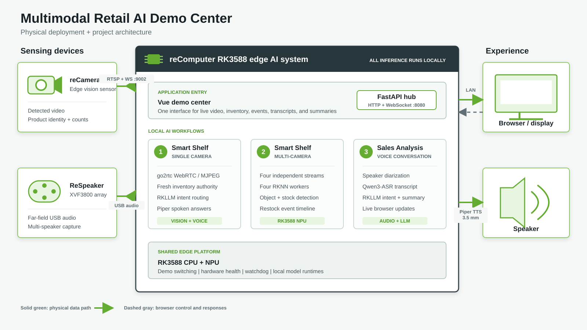
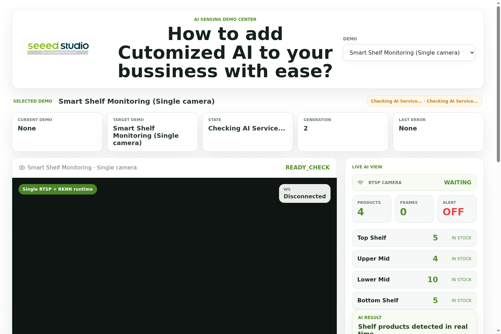
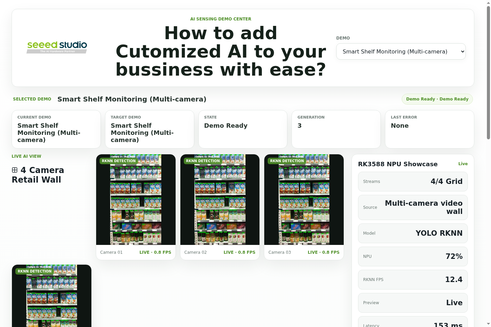
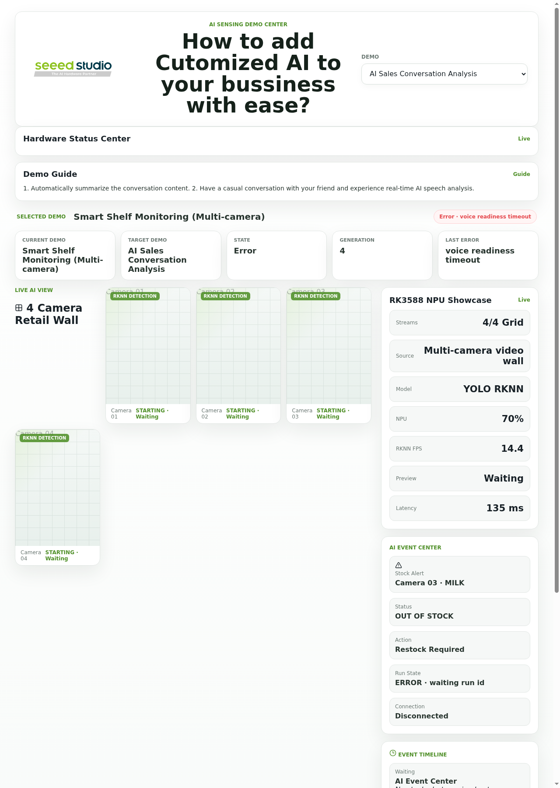

# Multimodal Retail AI Demo Center on reComputer RK3588

This repository contains four independently downloadable Seeed AI Lab projects. Use the matching Release Asset for the project you want; do not use the GitHub repository ZIP when distributing a single demo.

| Project | Hardware | Download asset |
| --- | --- | --- |
| Multimodal Retail AI Demo Center | reComputer RK3588 | `seeed-ai-lab-retail-ai-center-v<version>.tar.gz` |
| RK1828 Qwen3-4B Long Context Benchmark | RK1828 | `seeed-ai-lab-rk1828-4b-benchmark-v<version>.tar.gz` |
| RK1820 Qwen3-1.7B Long Context Benchmark | RK1820 | `seeed-ai-lab-rk1820-qwen3-1p7b-benchmark-v<version>.tar.gz` |
| RK1820 Vision Story Studio | RK1820 | `seeed-ai-lab-rk1820-vlm-creative-v<version>.tar.gz` |

The RK1820 text package currently uses the available Firefly Qwen3-1.7B model package. The VLM package turns the 3B test into a local image-to-story creative studio. Each archive contains only one project and excludes the other demos, repository tooling, virtual environments, and model binaries.

Build and validate the four local assets with:

```bash
./tools/package-project.sh --all --version 1.0.0
for archive in dist/*.tar.gz; do ./tools/check-project-package.sh "$archive"; done
```

A local-first retail AI showcase that brings shelf vision, inventory-aware voice interaction, multi-stream RKNN inference, and sales conversation analysis into one browser interface on a reComputer RK3588.

**Version 1.0.0 | Debian 12 arm64 | Apache-2.0**

## Overview

The Demo Center combines a reComputer RK3588, reCamera, and ReSpeaker XVF3800 into three switchable experiences. Video, audio, inventory state, speech recognition, language-model processing, and text-to-speech stay on the edge device during operation. No cloud API is required after the runtime assets have been prepared.

- One Vue interface and one FastAPI origin for all demos
- RKNN object detection accelerated by the RK3588 NPU
- Local Qwen3-ASR, speaker diarization, RKLLM, and Piper TTS
- Resource-aware switching with readiness checks and background runtime supervision
- Hardware health, runtime state, live events, and fallback behavior visible in the UI

## System architecture



reCamera owns the single-camera detection and provides detected video plus authoritative product-state messages. ReSpeaker provides far-field audio. The reComputer runs the web application, multi-camera inference, and voice workloads, serves the operator UI over the local network, and sends spoken inventory answers to the attached speaker.

| Connection | Default | Purpose |
| --- | --- | --- |
| Browser to reComputer | `http://<RK3588-IP>:8080` | Unified UI, REST API, and WebSocket events |
| reCamera to reComputer | RTSP `:8554`, WebSocket `:9002` | Detected video and live product state |
| ReSpeaker to reComputer | USB audio, ALSA card `Array` | Voice capture and speaker turns |
| reComputer to speaker | ES8311 3.5 mm output | Piper speech playback |
| Local ASR / RKLLM | `:8621` / `:8001` | Speech recognition and intent/summary generation |

## Demo experiences

| Demo | Input | Edge AI pipeline | Result |
| --- | --- | --- | --- |
| Smart Shelf: single camera | reCamera + ReSpeaker | Product-state validation, Qwen3-ASR, RKLLM intent routing, Piper TTS | Live stock state and grounded spoken answers |
| Smart Shelf: multi-camera | Four video streams | Four RKNN workers on RK3588 | Live detections, shelf events, and restock alerts |
| Sales Conversation Analysis | ReSpeaker XVF3800 | VAD, CAM++ diarization, Qwen3-ASR, local RKLLM | Speaker-attributed transcript and conversation summary |

### 1. Smart Shelf: single camera



The reCamera sends its detected RTSP stream and product-state WebSocket messages to the application. Staff can ask questions such as "How many bottles are there?" or "What is missing?" and receive both an on-screen and spoken answer.

Inventory answers are grounded in deterministic application logic. RKLLM identifies the question intent, but product names and quantities are calculated from a fresh, initialized reCamera snapshot. If that state is missing or stale, the assistant reports that inventory is unavailable instead of inventing an answer.

The browser uses WebRTC when go2rtc is installed and healthy. MJPEG remains available as the automatic fallback.

### 2. Smart Shelf: multi-camera



Four independent capture and inference workers process shelf video concurrently. The dashboard shows each annotated feed, capture/inference/display rates, NPU worker state, and a shared restock event timeline.

The repository includes the two FP16 RKNN models, the matching RKNN Lite 2.3.2 arm64 wheel, runtime configuration, and a sample video. The bundled showcase uses fixed shelf regions and configured demonstration events; recalibrate the regions and event logic before using a different camera position or shelf layout.

### 3. Sales Conversation Analysis



ReSpeaker audio passes through Silero VAD, CAM++ speaker embeddings, and Qwen3-ASR. Speaker turns stream into the browser as the conversation progresses. A local RKLLM then produces a summary, customer intent, and recommended next action without sending the conversation to a cloud service.

## Requirements

### Hardware

| Component | Requirement |
| --- | --- |
| Edge computer | reComputer with RK3588, 8 GB RAM minimum |
| Camera | reCamera reachable over USB networking or Ethernet |
| Microphone | ReSpeaker XVF3800 USB microphone array |
| Audio output | Headphones or amplified speaker on the ES8311 3.5 mm jack |
| Storage | At least 12 GB free when the offline voice bundle is installed |
| Operator display | Browser on the reComputer or another device on the same LAN |

### Host software

- Debian 12 arm64 with a working RKNPU driver/runtime
- Python 3.11 and `python3-venv`
- Node.js 18 or newer with npm
- `curl`, `alsa-utils`, and a working PulseAudio/PipeWire user session
- Docker with Compose for the ASR and RKLLM voice services
- go2rtc is optional; the application falls back to MJPEG without it

### Asset availability

| Asset | Included in Git | Prepared by |
| --- | ---: | --- |
| Two FP16 RKNN shelf models | Yes | Repository checkout |
| RKNN Lite 2.3.2 CPython 3.11 arm64 wheel | Yes | Repository checkout |
| Multi-camera sample video | Yes | Repository checkout |
| Piper arm64 runtime and `en_US-amy-low` voice | No | `scripts/bootstrap.sh` downloads and verifies them |
| Qwen3-ASR image/model volume and RKLLM image | No | Separate offline bundle or compatible published image |

The complete offline voice bundle is approximately 4.4 GB and is intentionally excluded from Git.

## Quick start

### 1. Connect the hardware

1. Connect reCamera over USB networking or Ethernet. Its default address is `192.168.42.1`.
2. Connect the ReSpeaker XVF3800 and confirm that its ALSA card name contains `Array`.
3. Connect the speaker or headphones to the reComputer ES8311 3.5 mm output.
4. Keep the desktop audio session available if the service uses PulseAudio or PipeWire.

See [Hardware setup](docs/hardware-setup.md) for connection checks and expected ports.

### 2. Clone and configure

```bash
git clone https://github.com/Seeed-Projects/Lab-Prooject-RK.git
cd Lab-Prooject-RK
cp .env.example .env
```

Review `.env` before installation, especially the reCamera address, ALSA card, audio sink, and local model endpoints.

### 3. Prepare the application

```bash
./scripts/bootstrap.sh
./scripts/verify.sh
```

`bootstrap.sh` creates the backend and RKNN virtual environments, installs the bundled RKNN Lite wheel, builds the Vue frontend, and downloads checksum-pinned Piper assets. Internet access is required for Python/npm dependencies and Piper unless those dependencies are already cached.

### 4. Prepare the voice runtime

This step is required for the voice inventory assistant and sales conversation demo. It can be skipped when evaluating only the multi-camera showcase.

Place the separately distributed bundle in `services/voice-pipeline/deploy/bundle/`, then run:

```bash
cd services/voice-pipeline
./deploy/restore.sh ./deploy/bundle
docker compose -f deploy/docker-compose.asr-realtime.yml up -d
docker compose -f deploy/docker-compose.llm-summary.yml up -d
./bootstrap.sh
cd ../..
```

The ASR service should answer on port `8621`; the OpenAI-compatible RKLLM service should answer on port `8001`.

### 5. Run the Demo Center

For a manual background launch:

```bash
./scripts/start.sh
./scripts/status.sh
```

Open `http://<RK3588-IP>:8080`. Selecting a demo in the top-right menu deactivates the previous experience, starts or activates the selected pipeline, waits for readiness, and updates the hardware status bar. Lightweight supervision and the reCamera prewarm connection can remain resident between switches.

Stop the manual service with:

```bash
./scripts/stop.sh
```

For boot-time production deployment, install the systemd service instead:

```bash
sudo ./scripts/install.sh
```

The installer preserves the repository location, runs the service as the repository owner, and enables the XVF3800 recovery watcher.

## Configuration

All deployment-specific settings live in `.env`; the application does not require a fixed installation directory.

| Variable | Default | Description |
| --- | --- | --- |
| `DEMO_HUB_HOST` | `0.0.0.0` | Web server bind address |
| `DEMO_HUB_PORT` | `8080` | Unified UI and API port |
| `RECAMERA_IP` | `192.168.42.1` | reCamera network address |
| `RECAMERA_RTSP_URL` | `rtsp://192.168.42.1:8554/detected` | Detected camera stream |
| `RECAMERA_WS_URL` | `ws://192.168.42.1:9002` | Authoritative product-state stream |
| `CARD` | `Array` | ReSpeaker ALSA card selector |
| `ASR_URL` | `http://127.0.0.1:8621` | Local Qwen3-ASR service |
| `VOICE_IMAGE` | `openvoicestream:asr-realtime` | Compatible ASR container image |
| `LLM_SUMMARY_URL` | `http://127.0.0.1:8001` | Local RKLLM OpenAI-compatible endpoint |
| `PIPER_SINK` | ES8311 sink | PulseAudio/PipeWire playback sink |
| `PIPER_LENGTH_SCALE` | `1.12` | Piper speaking speed; larger values are slower |
| `GO2RTC_BIN` | `go2rtc` on `PATH` | Optional RTSP-to-WebRTC bridge |
| `MULTI_*_FPS` | See `.env.example` | Capture, inference, and display rate targets |

## Validation and health checks

Run the complete repository validation:

```bash
./scripts/verify.sh
```

It compiles backend Python sources, runs backend/voice/multi-camera tests, builds the frontend, validates shell syntax, checks versioned model files, and reports optional hardware services.

Useful runtime checks:

```bash
curl -fsS http://127.0.0.1:8080/api/v1/health
curl -fsS http://127.0.0.1:8080/api/v1/hardware/status
curl -fsS http://127.0.0.1:8080/api/v1/showcase/status
curl -fsS http://127.0.0.1:8621/health
curl -fsS http://127.0.0.1:8001/health
```

Interactive API documentation is available at `http://<RK3588-IP>:8080/docs`.

## Project structure

```text
backend/                       FastAPI hub, demo adapters, supervision, tests
frontend/                      Vue 3 operator interface
demos/multi-camera-shelf/      RKNN models, inference pipeline, sample video
services/voice-pipeline/       ReSpeaker capture, ASR, diarization, summaries
models/                        Downloaded Piper runtime and voice (Git-ignored)
deploy/systemd/                Portable application and recovery units
scripts/                       Bootstrap, verification, install, lifecycle tools
media/                         Architecture diagram and current screenshots
docs/                          Architecture, hardware, and troubleshooting guides
```

## Troubleshooting

| Symptom | First check |
| --- | --- |
| Demo remains in `STARTING` | `./scripts/status.sh` and `/api/v1/showcase/status` |
| Single-camera view has no video | reCamera ports `8554` and `9002`; MJPEG fallback status |
| Inventory assistant refuses a question | Confirm the product snapshot is initialized and less than five seconds old |
| Transcript appears but summary does not | Check `http://127.0.0.1:8001/health` |
| Text appears but no speech plays | Verify `PIPER_SINK` and the service user's audio session |
| Multi-camera demo exits | Confirm RK3588 arm64, RKNPU devices, and RKNN runtime compatibility |

See [Troubleshooting](docs/troubleshooting.md) for commands and recovery details.

## Operational boundaries

- RKNN model files only run with a compatible Rockchip NPU driver and runtime.
- The multi-camera showcase uses the included sample video, fixed shelf regions, and configured demonstration events. It is a deployment baseline, not a production inventory system.
- The single-camera inventory assistant requires fresh reCamera product-state data; video alone is not treated as inventory authority.
- The voice pipeline does not separate overlapping speech and performs the final RKLLM summary after the conversation.
- WebRTC is optional. MJPEG continues to work when go2rtc is unavailable.
- The web UI and internal WebSocket services do not provide public-network authentication. Keep the deployment on a trusted LAN or add a secured reverse proxy.

## Documentation

- [Architecture](docs/architecture.md)
- [Hardware setup](docs/hardware-setup.md)
- [Troubleshooting](docs/troubleshooting.md)
- [Multi-camera RKNN deployment](demos/multi-camera-shelf/README.md)
- [Voice pipeline](services/voice-pipeline/README.md)
- [Runtime asset policy](models/README.md)
- [Third-party notices](THIRD_PARTY_NOTICES.md)

## License

Original integration code in this repository is licensed under [Apache-2.0](LICENSE). Bundled models, sample media, vendor wheels, and upstream services retain their own terms. Review [THIRD_PARTY_NOTICES.md](THIRD_PARTY_NOTICES.md) before redistributing the complete package.
