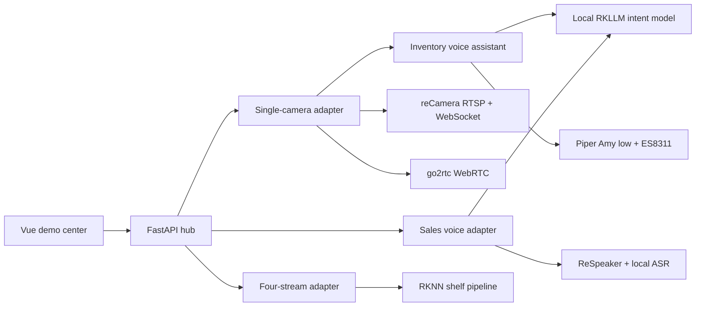

# Architecture

The browser talks to one FastAPI origin on port 8080. The backend owns demo switching and isolates the active visual/voice runtime while preserving the existing voice supervisor, watchdog, circuit breaker, and hardware health checks.



## Data authority

reCamera product-state WebSocket messages are the only inventory authority for the first demo. The assistant checks initialization and a five-second freshness window before building a structured answer. The local LLM classifies open questions, but quantities and product names are calculated from the validated snapshot.

The second demo runs four independent capture and RKNN inference streams against the included sample video. The third demo consumes ReSpeaker audio through the isolated voice container and streams ASR/diarization events to the browser.

## Repository layout

```text
backend/                       FastAPI hub, adapters and tests
frontend/                      Vue interface
demos/multi-camera-shelf/      RKNN demo, models and sample video
services/voice-pipeline/       ReSpeaker capture and ASR orchestration
models/                        Downloaded Piper assets (Git-ignored)
scripts/                       Bootstrap, install and lifecycle commands
deploy/systemd/                Portable service template
docs/                          Setup, troubleshooting and article draft
```
